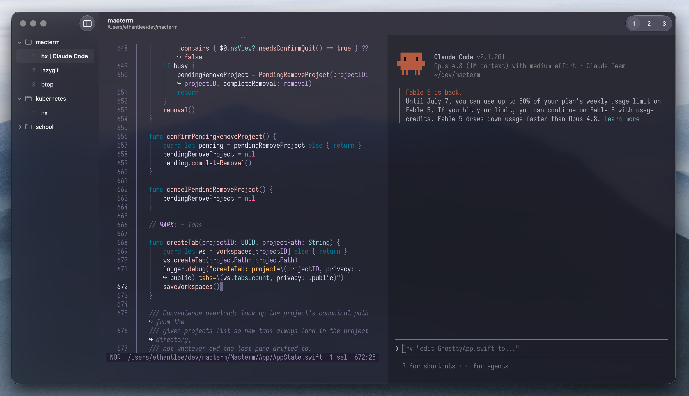

<h1 align="center">
  
  <br />
  CYOTE-arm
</h1>

<p align="center">
  <b>Create Your Own Terminal Experience</b> — a native macOS terminal with a vertical project sidebar and persistent multiplexing, built on libghostty
</p>

<p align="center">
  <sub>A personal fork of <a href="https://github.com/thdxg/macterm">Macterm</a> by arm — the same foundation, plus reboot-proof sessions and a task-oriented “context” workflow.</sub>
</p>

<p align="center">
  
</p>



## What CYOTE-arm adds

Everything Macterm does (see [below](#from-macterm-the-base)), plus:

- **Reboot resurrect** — sessions survive a full **reboot**, not just an app quit. Each pane's color scrollback is captured and replayed, and allowlisted programs (editors, pagers, monitors) are relaunched, so you reopen right where you left off even after the machine restarts.
- **Contexts** — switch workspaces by _task_, not by git repo. <kbd>⌘⇧P</kbd> opens the context picker; dormant contexts (state saved, nothing currently running) stay listed and dimmed, so closed work is always one keystroke away. Each pane's zmx session is named after its context, and `macterm session list` shows a live `ctx:` column joined back to the pane.
- **Recent toggles** — bounce between your last two contexts (<kbd>⌘⇧O</kbd>) or the last two panes (<kbd>⌘⌃O</kbd>), vim `ctrl-^` style.
- **Layout templates** — save the current workspace as a reusable, named layout and pick one when you create a context; ships with built-in starters.
- **Move cursor to the active pane** on focus change, so scroll-under-cursor just works.
- **Pane accents** — an optional accent border on the focused pane and dimming for the inactive ones.
- **Eager tab start** — opening a project starts every tab's processes, not just the active tab's.

## From Macterm (the base)

- **Persistent multiplexing** — projects, tabs, and split panes are saved and restored on relaunch. Shells run under a bundled [zmx](https://github.com/neurosnap/zmx) session, so quitting detaches and relaunching reattaches every pane with its scrollback and running processes intact.
- **Remote projects** — open a directory on another machine over SSH. Each pane is a persistent session _on the host_, so your shells survive quits, dropped connections, and even a local reboot.
- **Vertical project sidebar** — organize projects and their tabs in a native macOS sidebar.
- **Inherit cwd on split** — splitting a pane opens the new one in the source pane's current directory, including reattached zmx-backed panes.
- **Command palette** — press <kbd>⌘P</kbd> to split panes, switch projects, or open a directory; every row shows its keybind.
- **Declarative layouts** — describe a project's tabs, splits, and per-pane commands in YAML; the app builds the workspace from it on open.
- **Control CLI** — a bundled `macterm` command drives the running app over a local socket, so scripts and AI agents can spawn panes, run commands, and script layouts.
- **Quick terminal** — a global drop-down terminal on a hotkey (<kbd>⌃`</kbd>) for scratch work from anywhere.
- **Ghostty compatibility** — reads your existing `~/.config/ghostty/config`. Theme, font, keybinds — all of it just works.

## Install

CYOTE-arm builds from source — it's a personal fork, so there's no Homebrew cask or signed release.

```bash
mise install       # dev tools (gh, xcodegen, swiftformat, swiftlint, …)
mise run setup     # download the prebuilt GhosttyKit + bundled resources
mise run install   # build a Release app and install it to /Applications/CYOTE-arm.app
```

`mise run install` builds first, so it's the only command you need; to iterate on a debug build instead, use `mise run run`. The app installs as **CYOTE-arm.app** alongside any upstream Macterm at `/Applications/Macterm.app` — distinct name and bundle id, so the two never collide.

It isn't signed with an Apple Developer certificate, but `install` copies a locally-signed build straight into `/Applications`, so there's no `xattr` dance. There's no auto-updater either (Sparkle is intentionally off) — re-run `mise run install` to update.

## Documentation

CYOTE-arm inherits Macterm's guides, so the **base features** are documented at **[macterm.thdxg.dev/docs](https://macterm.thdxg.dev/docs/)** (its install steps are upstream-specific — build from source here instead):

- [Configuration](https://macterm.thdxg.dev/docs/configuration), [Command palette](https://macterm.thdxg.dev/docs/command-palette), [Quick terminal](https://macterm.thdxg.dev/docs/quick-terminal)
- [Declarative layouts](https://macterm.thdxg.dev/docs/declarative-layouts), [Session persistence](https://macterm.thdxg.dev/docs/session-persistence), [Remote projects](https://macterm.thdxg.dev/docs/remote-projects)
- [The `macterm` CLI](https://macterm.thdxg.dev/docs/cli)

The **CYOTE-arm additions** above are described in this README and in [AGENTS.md](AGENTS.md) (the codebase guide).

## Contributing

See [CONTRIBUTING.md](CONTRIBUTING.md) for setup, build, and PR guidelines.

## License

MIT
